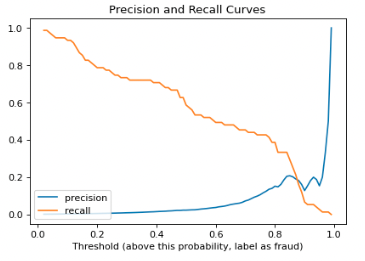
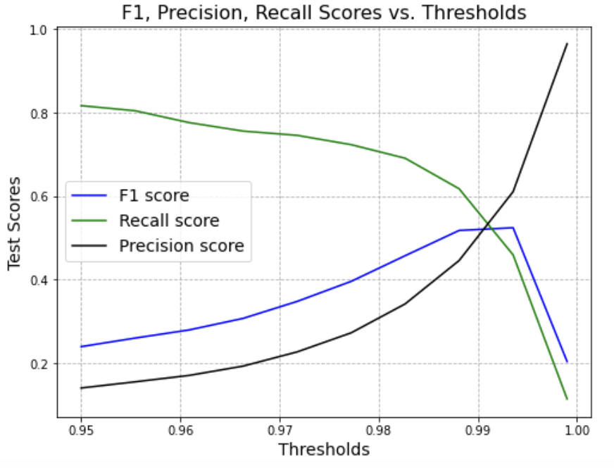

# OCBC AI Lab Fraud Detection

## Results
| Model | Precision | Recall | F1  |
| :---:   | :-: | :-: | :-: |
| Log reg with oversampling | 0 | 0.88 | 0.03
| LGBM with oversampling | 0.15 | 0.39 | 0.22
| Variational Autoencoder | 0.44 | 0.62 | 0.51



_Fig 1: LGBM precision recall curve at different probabilitiy threshold_

- Chose a threshold of 0.8 for LGBM (where probabilities >=0.8 are considered as fraud) by inspecting the precision recall curve. Threshold of 0.8 is chosen instead of the intersection between precision and recall curve because recall is a more importance metric to prioritise than precision for a fraud detection use case. We'd rather flag more transactions for next level review than to miss some of the fraudulent transactions. Hence, I chose 0.8 where the recall score is slightly higher, but precision score is not too low.




_VAE F1, Recall and Precision score at different percentile_

- Set the percentile threshold to determine error threshold as 0.988 by inspecting the curve above. Similar to the reasoning above that recall is a more important metric, percentile of 0.988 is chosen where it is the point before the sharper decline in recall score (green line). 


## Next steps
- Find more data source, especially alternative data. The bank has many touchpoints with the customers such as mobile app micro behaviours, social media, loan sign up behaviours, relationship with the bank (e.g. how many products this customer bought, campaign history, balance, banking activities etc).
- Perform more hyperparameter tuning (e.g. width of the model, learning rate etc)

## To view the notebook
- create and activate conda env
```
$ conda create -n boost_conda python=3.8
$ conda activate boost_conda
$ jupyter lab
```
## To run the notebook
(The large data file results in the zipped file becoming bigger than the allowable limit to be sent as an email attachment)
Download the raw data from : 
- https://drive.google.com/file/d/1PVYKaRnQsAe8was1bfjJF1YzNZ_FagvK/view?usp=sharing and place it in `data/raw` folder

